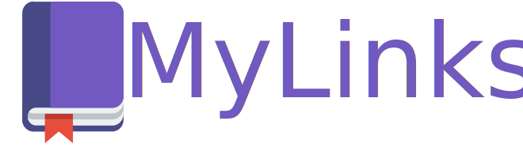
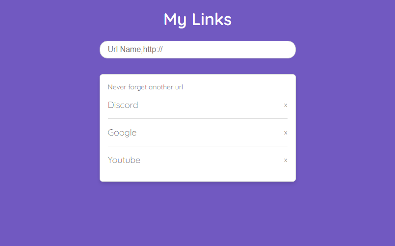

<h1 align="center">
 
    
 
 
</h1>

##

    <a href="#-features">Features</a>&nbsp;&nbsp;&nbsp;|&nbsp;&nbsp;&nbsp;
    <a href="#-technologies">Technologies</a>&nbsp;&nbsp;&nbsp;|&nbsp;&nbsp;&nbsp;
    <a href="#-deploy">Deploy</a>&nbsp;&nbsp;&nbsp;|&nbsp;&nbsp;&nbsp;
    <a href="#-getting-started">Getting Started</a>&nbsp;&nbsp;&nbsp;|&nbsp;&nbsp;&nbsp;
    <a href="#-contributing">Contributing</a>&nbsp;&nbsp;&nbsp;|&nbsp;&nbsp;&nbsp;
    <a href="#memo-license">License</a>

 O projeto foi construido a partir da aula da disponibilizada no <a href="https://youtu.be/DiXbJL3iWVs">Masterclass</a> realizado pela RocketSeat.   
 Neste projeto foi desenvolvido uma pagina que guarda links de sites, com seu nome de aplicação e URL. Tudo funciona através de uma API que alimenta o front-end do projeto e atualiza um arquivo JSON de todas as modificações, sejam elas uma criação de um novo elemento ou uma exclusão. Foram estudados vários módulos nativos do Node.

    

## 📈 Features
<!-- ❌✅ -->&nbsp;&nbsp;&nbsp;
1. ✅ A página se alimenta da api para mostrar os dados previamente guardados no arquivo JSON. (LISTAR)
2. ✅ Adicione uma função para deletar os dados que estão no arquivo JSON, quando o usuario clicar no X na tela. (DELETE)
3. ✅ Adicione uma função para criar os dados no arquivo JSON, quando o usuario der submit na tela de um novo link. (CRIAR)

## 🛠 Technologies

- *NodeJS;*

## 🚀 Deploy

1 - Entre da pasta do projeto`cd mylinks-app/`

2 - Utilize o [yarn](https://classic.yarnpkg.com/lang/en/) para iniciar o projeto. Dentro da pasta execute `yarn install` para baixar as dependências (Só existe o [Nodemon](https://github.com/remy/nodemon/)).

3 - `$ yarn api` para executar a api na porta 3000 do localhost.

4 - `$ yarn start` para subir o front do projeto na porta 5000 do localhost.

> Para mais informações verifique o `package.json`

## 💻 Getting started

- Clone esse repositório apenas usando: `git clone https://github.com/rafaeljurkfitz/my-links.git`

## 🤝 Contributing

Contributions are what make the open source community such an amazing place to be learn, inspire, and create. Any contributions you make are **greatly appreciated**.

1. Fork the Project
2. Create your Feature Branch (`git checkout -b feature/AmazingFeature`)
3. Commit your Changes (`git commit -m 'Add some AmazingFeature'`)
4. Push to the Branch (`git push origin feature/AmazingFeature`)
5. Open a Pull Request

## :memo: License

This project is licensed under the MIT License - see the [LICENSE](https://opensource.org/licenses/MIT) page for details.
